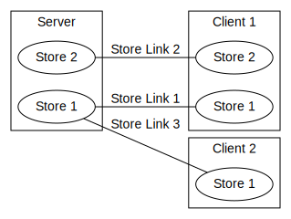

# co-share

A Javascript framework for easily building shared applications such as chats and games.

`npm i co-share`

## **When to use**

Building **multiuser applications for the web** is often challenging as asynchronous communication can drastically increase the system complexity.
Writing **robust and performant shared applications** requires a structured and fitting architecure.

We propose the abstraction of **shared stores** to distribute logic and data between participating system.
By using Javascript & Node.js the same code can be used on the client and on the server to carry out the **platform indepedent communication**.

## **How to use**

The library is framework independent as it runs on the `Web` and `NodeJS`. However, we provide `react` hooks out of the box to simplify the experience. _Please help us to build tools for more web frameworks._

```typescript
new Example extends Store {
    action = Action.create(this, "actionName", (origin, parameter) => {
        action.publishTo(
            origin == null ?
                { to: "all" } :
                { to: "all-except-one", except: origin },
            parameter
        )
    })
}
```

The `Stores` contain both, the **platform indepedent logic** and the **data**. Platform independent logic is specified as `Action`s, which are methods that can be invoked on a remote client (similar to RPC/RMI). Above, we use `publishTo` to make the store execute the given action with the provided `parameter` on all nodes that are linked to this store.

## [**Tutorial**](https://cocoss-org.github.io/co-share/counter)

We will build a global synchronized counter that can be increased asynchronously by every client.

## [**Examples**](https://cocoss-org.github.io/co-share)

*The code for each example, is provided under the sample*

-   [Request](https://cocoss-org.github.io/co-share/request) - request response paradigma
<!-- * [Group Chat](https://cocoss-org.github.io/co-share/group-chat) - a whatsapp like chat implementation -->
-   [Message](https://cocoss-org.github.io/co-share/message) - direct client to client messaging without any persistent storage in between
-   [Lockable](https://cocoss-org.github.io/co-share/lockable) - advanced lock functionality to prevent editing by multiple people simultaneously
-   [Optimistic Lockable](https://cocoss-org.github.io/co-share/optimistic-lockable) - performance optimize lockable that allows for optimistic behaviour and error correction
-   [Whiteboard](https://cocoss-org.github.io/co-share/whiteboard) - collaborative drawing on a shared whiteboard
-   [Transformable](https://cocoss-org.github.io/co-share/transformable) - shared 3D transformation
---
- [Networked Counter using SocketIO](https://github.com/cocoss-org/co-share-socketio-counter-example) - just like the counter from the tutorial but with a server/client architecture using SocketIO 

## Example Architecture



In a multiuser scenario stores are connected using `StoreLink`s. One Store can have 0-N `StoreLink`s to other participants.

## **In depth description**

This framework revolves around the idea of **Stores** which can represent any entity or information. A **Store** is a class which may contain a set of **Actions** which are methods which can be executed remotely. The communication for executing an action remotely is carried out by the connection of your choice, for instance with socketio.

However, executing an **Action** requires an established **StoreLink** for a connection. This **StoreLink** uniquely identifies the relation between local store and remote store and vice versa.
Setting up a **StoreLink** can either be done manually or automatically by **subscribing** to a certain **Store**. When subscribing to a **Store** from a host, its store will provide the initial parameters to create a local copy of that store. The parameters are provided by a **Subscriber** running on every **Store** to determine if and what a requesting client should know about the **Store**. **Subscribers** can also deny a subscription request.

## Supporting Packages

-   **co-share-socketio** - networking implementation using [socketio](https://github.com/socketio/socket.io)
-   **co-share-peer** - p2p audio/video/data streaming/communication using [simple-peer](https://github.com/feross/simple-peer)
-   **co-share-geckosio** - _Idea_ - networking implementation using [geckosio](https://github.com/geckosio/geckos.io)
